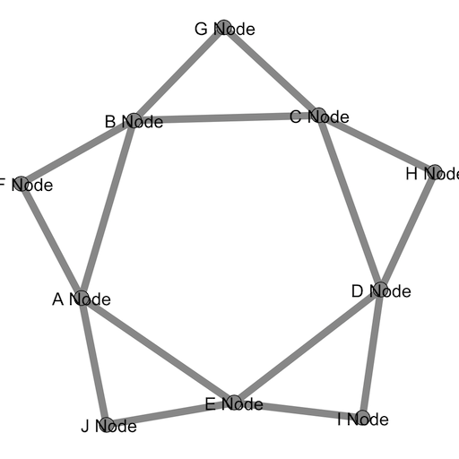

Gephi Streaming Java Client
======================

This is a Java client implementation of the [Gephi Streaming Plugin web API](http://wiki.gephi.org/index.php/Graph_Streaming#Plugin_interface).

# Usage

See the [Gephi Streaming Plugin example usage](http://wiki.gephi.org/index.php/Graph_Streaming#Gephi_as_Master) 
for how to configure Gephi to act as a master server. Once Gephi has a master server running with a workspace
attached to it (`workspace0` in this example), the following example code will create a simple star 
network.

    // setup
    GephiClientConfig config = new GephiClientConfig()
        .withUrl(“http://localhost:8080/workspace0”);

    DefaultHttpClient httpClient = 
        new DefaultHttpClient(new PoolingClientConnectionManager());

    GephiStreamingClient client = 
        new GephiStreamingApacheClient(config, httpClient);

	// nodes
	client.addNode(new Node("A", "A Node", 1L));
	client.addNode(new Node("B", "B Node", 1L));
	client.addNode(new Node("C", "C Node", 1L));
	client.addNode(new Node("D", "D Node", 1L));
	client.addNode(new Node("E", "E Node", 1L));
	client.addNode(new Node("F", "F Node", 1L));
	client.addNode(new Node("G", "G Node", 1L));
	client.addNode(new Node("H", "H Node", 1L));
	client.addNode(new Node("I", "I Node", 1L));
	client.addNode(new Node("J", "J Node", 1L));
	
	// edges
	client.addEdge(new Edge("A-B", "A", "B", false, 1L));
	client.addEdge(new Edge("B-C", "B", "C", false, 1L));
	client.addEdge(new Edge("C-D", "C", "D", false, 1L));
	client.addEdge(new Edge("D-E", "D", "E", false, 1L));
	client.addEdge(new Edge("E-A", "E", "A", false, 1L));
	client.addEdge(new Edge("F-A", "F", "A", false, 1L));
	client.addEdge(new Edge("F-B", "F", "B", false, 1L));
	client.addEdge(new Edge("G-B", "G", "B", false, 1L));
	client.addEdge(new Edge("G-C", "G", "C", false, 1L));
	client.addEdge(new Edge("H-C", "H", "C", false, 1L));
	client.addEdge(new Edge("H-D", "H", "D", false, 1L));
	client.addEdge(new Edge("I-D", "I", "D", false, 1L));
	client.addEdge(new Edge("I-E", "I", "E", false, 1L));
	client.addEdge(new Edge("J-E", "J", "E", false, 1L));
	client.addEdge(new Edge("J-A", "J", "A", false, 1L));

With the network looking something like this (after applying a Force Atlas layout):

## Example Spring Configuration

    <bean id="client" class="org.gephi.streaming.client.GephiStreamingApacheClient">
        <constructor-arg name="config" ref="config" />
        <constructor-arg name="client" ref="httpClient" />
    </bean>
    
    <bean id="config" class="org.gephi.streaming.client.model.GephiClientConfig">
        <property name="url" value="http://localhost:8080/workspace0" />
    </bean>
    
    <bean id="httpClient" class="org.apache.http.impl.client.DefaultHttpClient">
        <constructor-arg>
            <bean class="org.apache.http.impl.conn.PoolingClientConnectionManager"/>
        </constructor-arg>
    </bean>

# Features

The following features are implemented:

* Node/Edge creation, modification, and deletion (`?operation=updateGraph`)
* Basic HTTP authentication

The following features are not yet implemented:

* Node and edge retrieval (`?operation=getNode` and `?operation=getEdge`)
* "Native" HTTP mode (using `java.net` & `java.io` instead of [Apache HTTP Components](http://hc.apache.org/))

The following features are not planned:

* Network download and streaming (`?operation=getGraph`)

# Maven Dependency Information

Once built (see build info section below), this library can be incorporated into a maven project using the following `<dependency>` information:
        
    <dependency>
        <groupId>org.gephi</groupId>
        <artifactId>gephi-streaming-client</artifactId>
        <version>0.0.1-SNAPSHOT</version>
    </dependency>

**NOTE - This artifact has not yet been released into a central maven repository.**

# Build Info

Version 0.0.1-SNAPSHOT of this library is built and tested using Maven 3.0.3 and Java 1.6 against Gephi 0.8.2 
beta. Version 0.0.2-SNAPSHOT of this library is build and tested using Maven 3.5.4 and Java 1.8 against Gephi 0.9.2.
Note that integration tests are enabled by default via the failsafe plugin which
assumes a running Gephi master server with a workspace endpoint available at 
`http://localhost:8080/workspace1`. Use `mvn install -DskipITs` to build w/o running 
the live integration tests.
